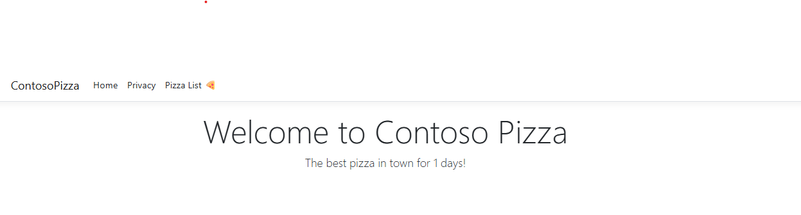
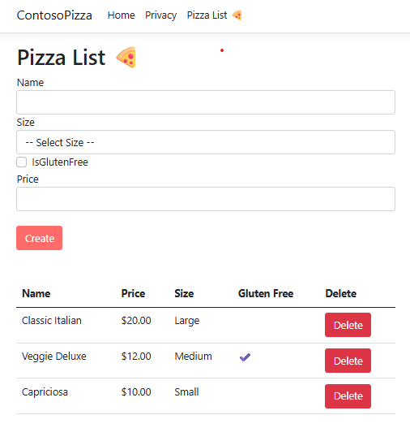

# Contoso Pizza Management System 🍕

A modern web application built with **ASP.NET Core Razor Pages** using **C#**. This project serves as a content management system for a pizza restaurant, allowing users to view the status of the shop, browse the menu, and manage inventory through a responsive web interface.

## 🚀 Features

* **Shop Status Tracking:** A dynamic home page featuring a counter that tracks how many days the pizza shop has been open.
* **Menu Management:** A data-driven section to list all available pizzas with details like price, size, and gluten-free options.
* **Interactive Forms:** Users can add new pizzas to the menu using robust forms with input validation.
* **CRUD Operations:** Full capability to Create, Read, and Delete pizza entries from the system.
* **Responsive Design:** Built with a clean interface usable on mobile and desktop devices.

## 📸 Screenshots

### 1. Home Page
*Displays the welcome message and tracks the number of days since the site opened.*



### 2. Pizza List Management
*The management interface where you can view the menu, add new pizzas, and delete existing ones.*



## 🛠️ Technologies & Concepts Used

This project demonstrates the use of key ASP.NET Core patterns and technologies:

* **Framework:** ASP.NET 8 Core (Razor Pages)
* **Language:** C#
* **Architecture:**
    * **Razor Pages:** Page-focused architecture for building dynamic web UI.
    * **Model-View-ViewModel (MVVM) Pattern:** Separation of concerns using PageModels (`.cshtml.cs`).
    * **Dependency Injection (DI):** Managing the Pizza service lifecycle.
* **Key Features:**
    * **Tag Helpers:** Streamlined HTML generation and form binding.
    * **Model Binding:** Automatically mapping HTTP request data to C# objects.
    * **Data Annotations:** Server-side validation for form inputs.
    * **Page Handlers:** Handling HTTP GET and POST requests explicitly (`OnGet`, `OnPost`).
* **Frontend:** HTML5, CSS3, Bootstrap
* **Version Control:** Git & GitHub

## 📦 Getting Started

To run this project locally:

1.  Clone the repository:
    ```bash
    git clone [https://github.com/marius2347/ContosoPizza-using-ASP.NET-Core-Razor-Pages-in-CSharp.git](https://github.com/marius2347/ContosoPizza-using-ASP.NET-Core-Razor-Pages-in-CSharp.git)
    ```
2.  Navigate to the project directory.
3.  Run the application:
    ```bash
    dotnet watch
    ```
4.  Open your browser and navigate to the localhost port shown in the terminal (usually `https://localhost:7000` or similar).

## 📬 Contact

If you have any questions about this project, feel free to reach out:

* **Email:** [mariusc0023@gmail.com](mailto:mariusc0023@gmail.com)
* **GitHub:** [marius2347](https://github.com/marius2347)
